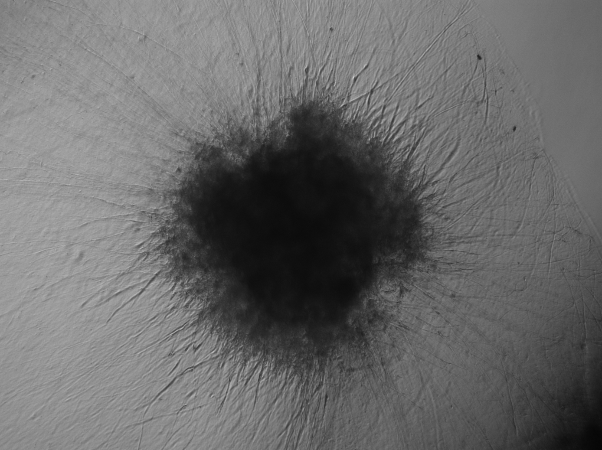
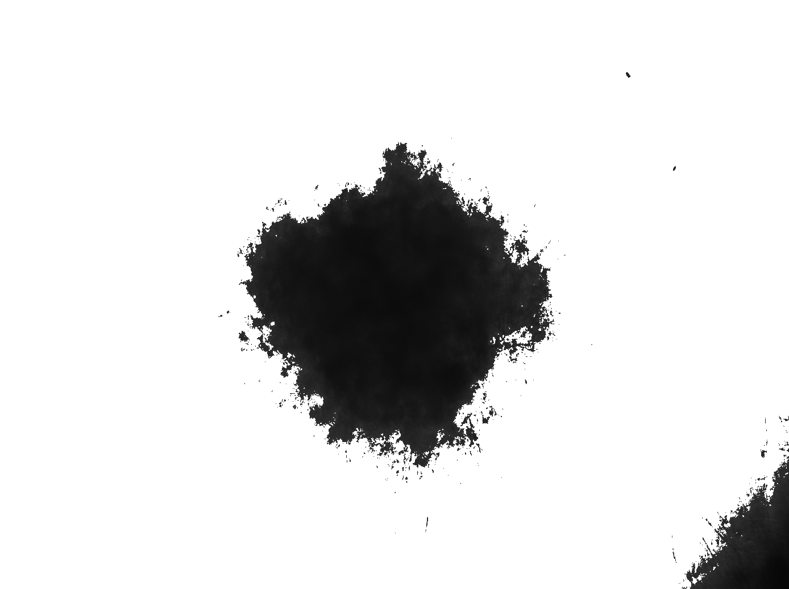
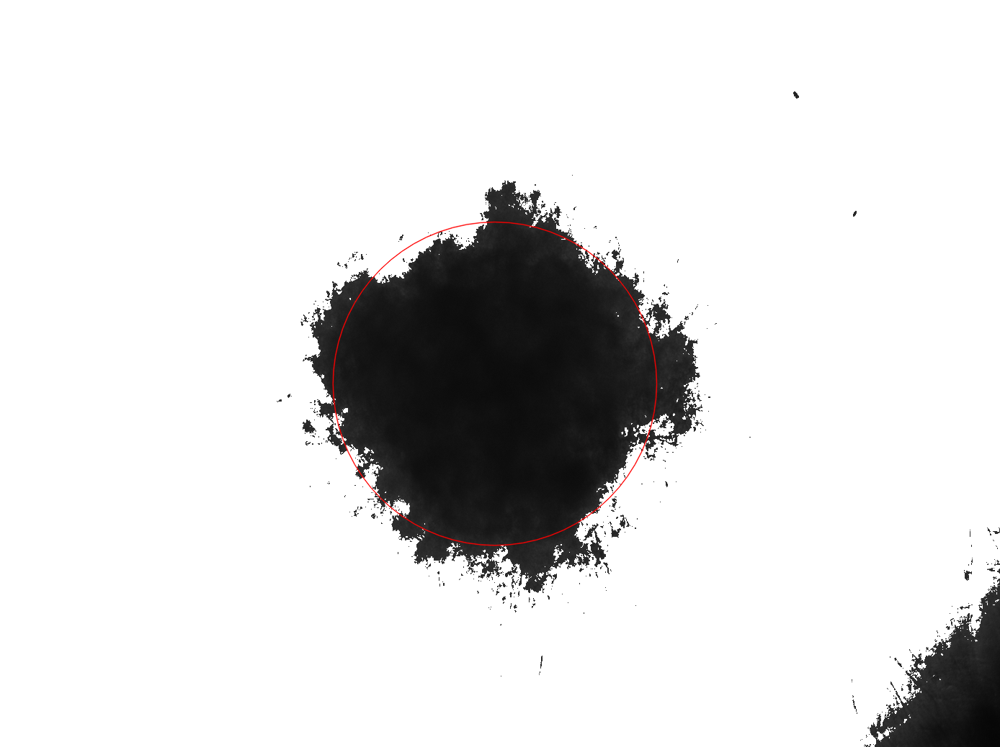

# OrganoidBlobSize
A python toolkit to automatically compute the size (area) of an organoid center. Code was written by Dr. Luke Davis.

>All images provided were produced by *Nathasia Muwanigwa* (https://wwwen.uni.lu/lcsb/people/nathasia_muwanigwa) and are **not** to be used for commercial purposes and permission must be granted by Nathasia Muwanigwa before any image can be reproduced elsewhere.

The rest of the repository (that isn't an image) is under CC-BY-SA 2.0 https://creativecommons.org/licenses/by-sa/2.0/.

(This was done as an extra-curricular venture, **this works as is**. Please do play around with the blob criteria to further "refine" the areas.)

## System Requirements

This code relies only on python3 (version 3.6.9). Please install python3 (free) on your system (Windows, Linux, Mac). The code was tested on Ubuntu linux 18 LTS.

Python3 packages to install:

``
alphashape 1.1.0 https://pypi.org/project/alphashape/
Numpy 1.19.3 https://pypi.org/project/numpy/
Matplotlib 3.3.2 https://pypi.org/project/matplotlib/
Pillow 8.0.0 https://pypi.org/project/Pillow/
opencv-python (cv2) 4.4.0.44 https://pypi.org/project/opencv-python/
``
For windows users this article might help: https://solarianprogrammer.com/2016/09/17/install-opencv-3-with-python-3-on-windows/.

## How to use the script

First we need images. Place your organoid blob images in the folder ``images``. Ensure that each image is as you would expect and they all share the same area per pixel (and ideally size). The code works on all the images present in the ``images`` folder, so ensure you only put in the images you want to analyse. The file names can be whatever, the code preserves these.

An image could look like:

By running the program (right clicking ``Example_workflow.py`` then running with python3 or running on the command line as ``python3 Example_workflow.py``) you will first see that the program filters the images (Gaussian or Median filter e.g.). The filtered images are shown in ``filtered_images`` folder.

Our example image above, when filtered looks like

The program then attempts to find a circle that fits the blob. Such a circle could look like

The program computes the area of the circle which, with suitable blob criteria, should well approximate the area of the blob. The area is saved in units specified from the area per pixel variable in ``Example_workflow.py``. The areas are saved in the ``data`` folder.

## Example_workflow.py

The main code for this problem, to refine the areas you only need to edit this code.

# Supporting and other useful codes

These codes should be present in the same folder as ``Example_workflow.py`` but, if you don't know what you are doing, you shouldn't edit them.

## py_image_LD.py 

Main supporting code. Contains functions to manipulate and probe the images.

## cluster.py

Contains the functions to cluster and segment objects, could be useful for further enhancements/problems.
